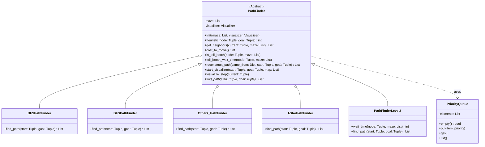

```mermaid
classDiagram
    class PriorityQueue {
        -elements: List
        +empty() bool
        +put(item, priority)
        +get()
        +list()
    } 

    class PathFinder {
        <<Abstract>>
        -maze: List
        -visualizer: Visualizer
        +__init__(maze: List, visualizer: Visualizer)
        +heuristic(node: Tuple, goal: Tuple) int
        +get_neighbors(current: Tuple, maze: List) List
        +cost_to_move() int
        +is_toll_booth(node: Tuple, maze: List)
        +toll_booth_wait_time(node: Tuple, maze: List)
        +reconstruct_path(came_from: Dict, start: Tuple, goal: Tuple) List
        +start_visualizer(start: Tuple, goal: Tuple, map: List)
        +visualize_step(current: Tuple)
        +find_path(start: Tuple, goal: Tuple) List*
    }

    class BFSPathFinder {
        +find_path(start: Tuple, goal: Tuple) List
    }

    class DFSPathFinder {
        +find_path(start: Tuple, goal: Tuple) List
    }
    
    class Others_PathFinder {
        +find_path(start: Tuple, goal: Tuple) List
    }
    

    class AStarPathFinder {
        +find_path(start: Tuple, goal: Tuple) List
    }
    
    class PathFinderLevel2 {
        +wait_time(node: Tuple, maze: List) int
        +find_path(start: Tuple, goal: Tuple) List
    }
    
    
    
    
    PathFinder <|-- BFSPathFinder
    PathFinder <|-- DFSPathFinder
    PathFinder <|-- Others_PathFinder
    PathFinder <|-- AStarPathFinder
    PathFinder <|-- PathFinderLevel2
    PathFinder ..> PriorityQueue : uses
```

