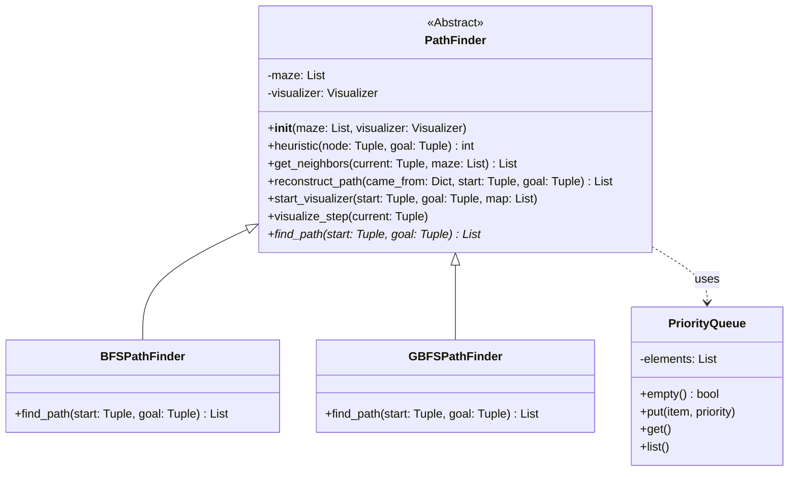

```mermaid
classDiagram
    class PriorityQueue {
        -elements: List
        +empty() bool
        +put(item, priority)
        +get()
        +list()
    }

    class PathFinder {
        <<Abstract>>
        -maze: List
        -visualizer: Visualizer
        +__init__(maze: List, visualizer: Visualizer)
        +heuristic(node: Tuple, goal: Tuple) int
        +get_neighbors(current: Tuple, maze: List) List
        +reconstruct_path(came_from: Dict, start: Tuple, goal: Tuple) List
        +start_visualizer(start: Tuple, goal: Tuple, map: List)
        +visualize_step(current: Tuple)
        +find_path(start: Tuple, goal: Tuple) List*
    }

    class BFSPathFinder {
        +find_path(start: Tuple, goal: Tuple) List
    }

    class GBFSPathFinder {
        +find_path(start: Tuple, goal: Tuple) List
    }

    
    PathFinder <|-- BFSPathFinder
    PathFinder <|-- GBFSPathFinder
    PathFinder ..> PriorityQueue : uses
```

