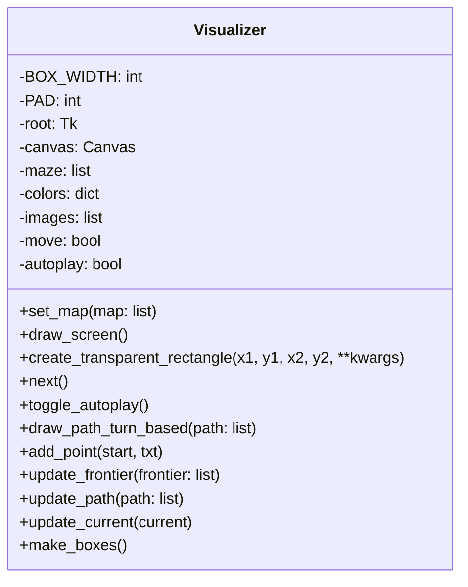

```mermaid
classDiagram
    class Visualizer {
        -BOX_WIDTH: int
        -PAD: int
        -root: Tk
        -canvas: Canvas
        -maze: list
        -colors: dict
        -images: list
        -move: bool
        -autoplay: bool
        +set_map(map: list)
        +draw_screen()
        +create_transparent_rectangle(x1, y1, x2, y2, **kwargs)
        +next()
        +toggle_autoplay()
        +draw_path_turn_based(path: list)
        +add_point(start, txt)
        +update_frontier(frontier: list)
        +update_path(path: list)
        +update_current(current)
        +make_boxes()
    }
```
